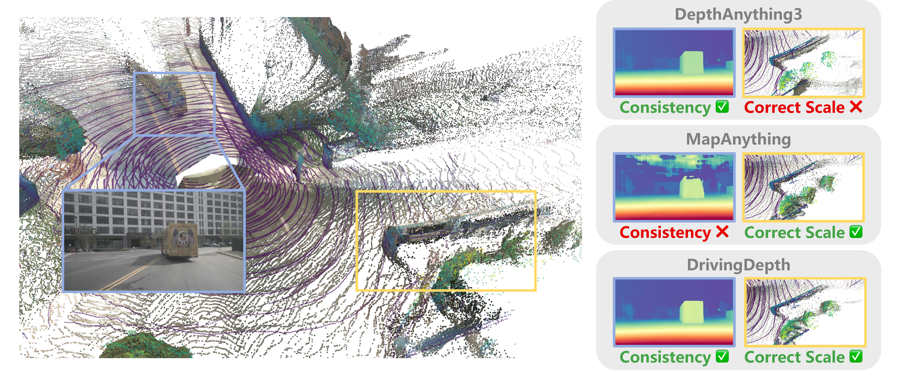
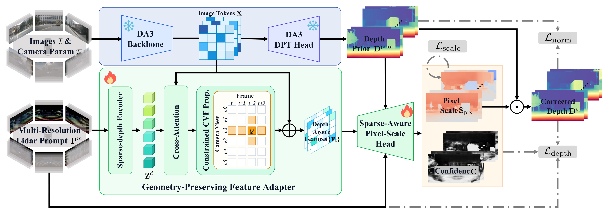
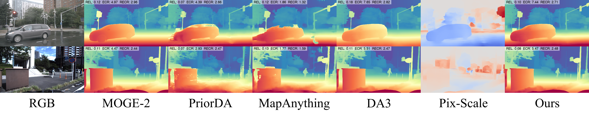

# DrivingDepth: Sparse-Prompted Pixel-wise Scale Correction for Driving Depth Estimation

<div align="center">


[](https://hcaelrs.github.io/DrivingDepth-page/)
[](https://arxiv.org/pdf/2606.31488)

</div>

<p align="center">
  
</p>

DrivingDepth is a sparse-prompted metric depth framework for autonomous driving. It resolves the **geometry--scale conflict** between dense visual geometry from depth foundation models and sparse, noisy metric anchors from projected LiDAR by learning a residual pixel-wise scale correction on top of a frozen foundation prior.

## 📰 News

- **2026-08-24:** 🚀 The nuScenes inference code is released! See [Getting Started](#-getting-started) for setup, weights, and evaluation.        
- **2026-06-30:** 🎬 Paper is released: [DrivingDepth arXiv](https://arxiv.org/pdf/2606.31488). Code will be released very soon.
- **2026-05-14:** 🎳 Demo is released: [DrivingDepth-page](https://hcaelrs.github.io/DrivingDepth-page/). Paper under writing, code to be organized soon.

## ✨ Highlights

- **Geometry-preserving metric calibration:** treats sparse LiDAR as geometric prompts rather than dense supervision targets.
- **Residual pixel-wise scale correction:** keeps the frozen DA3 prior as dense visual geometry and learns only the per-pixel scale needed for metric alignment.
- **Low-cost adaptation:** freezes the foundation model and trains only a lightweight scale head and feature adapter, fitting the full framework on a single 8-GPU node.
- **Sparse-aware prompting:** injects sparse-depth cues through a Geometry-Preserving Feature Adapter and a Sparse-Aware Pixel-Scale Head.
- **Robust driving depth:** uses learned confidence, surface-normal regularization, and scale smoothness to handle noisy or misaligned LiDAR projections.
- **Strong performance:** on nuScenes with 4-frame surround-view input, DrivingDepth achieves **11.19 AbsRel** and **5.741 EdgeCR**, outperforming MapAnything (**11.99 / 1.914**) in both metric accuracy and geometric consistency.

## 📌 Abstract

Dense depth estimation for autonomous driving faces a *geometry--scale conflict*: depth foundation models deliver pixel-aligned dense visual geometry without reliable metric scale, while projected LiDAR provides metric anchors that are sparse, noisy, and misaligned with image structures. Existing sparse-prompted methods incorporate LiDAR by regenerating depth from scratch, overriding the foundation model's coherent geometry and producing structural artifacts on visually continuous surfaces. Our key insight is that foundation models already capture geometrically coherent relative depth; no additional surface structure learning is required—only a per-pixel scale factor mapping relative geometry to metric coordinates. Based on this, we propose DrivingDepth, which treats sparse LiDAR as *geometric prompts* that locally calibrate a frozen foundation prior through residual pixel-wise scale correction, preserving dense visual geometry by construction. On nuScenes with 4-frame surround-view input, DrivingDepth achieves an AbsRel of 11.19 and an EdgeCR of 5.741, outperforming MapAnything (11.99/1.914) by simultaneously delivering SOTA metric accuracy and geometric consistency.

## 🧠 Method Overview

<p align="center">
  
</p>

DrivingDepth starts from a frozen Depth Anything 3 (DA3) prior and performs minimal-intervention metric calibration:

1. **Frozen visual geometry prior:** DA3 maps surround-view images and camera parameters to dense, coherent depth priors.
2. **Geometry-Preserving Feature Adapter:** sparse-depth tokens are fused with image tokens and propagated along constrained frame-view connections.
3. **Sparse-Aware Pixel-Scale Head:** multi-scale features and LiDAR prompts predict a pixel-wise correction map and confidence map.
4. **Metric output:** the corrected depth is produced by multiplying the frozen prior with the learned scale map and a clip-level global scale factor.

## 🚀 Getting Started

### 1. Environment

```bash
conda create -n dd python=3.12 -y
conda activate dd
pip install -r requirements.txt
```

The environment is largely compatible with [Depth Anything 3](https://github.com/ByteDance-Seed/Depth-Anything-3), so if you already have a working DA3 environment you can reuse it directly and only install the few extra packages listed in `requirements.txt`.

### 2. Data

Put the nuScenes dataset at `/data/nuscenes`, using standard devkit layout.

The evaluation config uses the `v1.0-test` split with all 6 surround cameras. If your dataset lives elsewhere, change `data.datasets.nuscenes.val.data_root` in `src/drivingdepth/configs/inference_nusc_4f1s1i.yaml`.

### 3. Weights

Download the finetuned checkpoint from [🤗 HCaelrs/DrivingDepth](https://huggingface.co/HCaelrs/DrivingDepth) into `checkpoints/`:

```bash
hf download HCaelrs/DrivingDepth nuscenes.pth --local-dir checkpoints
```

This gives `checkpoints/nuscenes.pth`, which is the path expected by `inference.load_from`.

### 4. Inference

```bash
bash scripts/run_inference_nusc.sh
# or with a different GPU count / config
NUM_PROCESSES=4 bash scripts/run_inference_nusc.sh src/drivingdepth/configs/inference_nusc_4f1s1i.yaml
```

The script launches distributed inference (8 processes by default) and then prints the aggregated per-view metrics from `summary.json`.

Results are written to `inference_output-4f1s1i/nuscenes/` (`depth/`, `depth_vis/`, `sky_mask/`, `pix_scale/`, `confidence/`, `sparse_gt/`, `batch_jsons/`, `summary.json`). **Expect roughly 16 GB of output**, so make sure the target disk has enough free space; set `inference.save_dir` in the config to redirect it.

## 🖼️ Qualitative Results

<p align="center">
  
</p>

DrivingDepth preserves RGB-depth consistency and produces metrically calibrated depth maps with fewer structural artifacts than sparse-prompted methods that regenerate depth from fused features.

## 📚 Citation

If you find this work useful, please consider citing:

```bibtex
@article{huang2026drivingdepth,
  title={DrivingDepth: Sparse-Prompted Pixel-wise Scale Correction for Driving Depth Estimation},
  author={Huang, Chi and Zhang, Wenhao and Yin, Hang and Wang, YuAn and Li, Hao and Wang, Bosheng and Sun, Xun and Wang, Liang},
  journal={arXiv preprint arXiv:2606.31488},
  year={2026}
}
```
